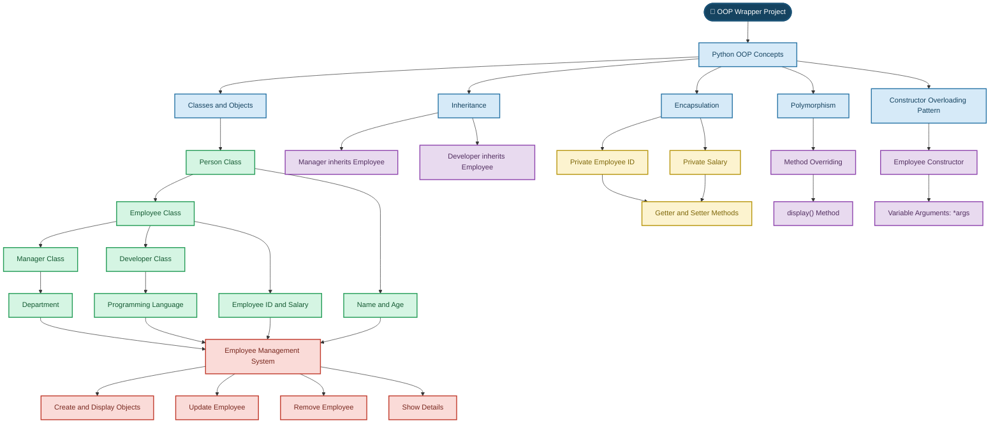

### ✨ Object-Oriented Programming with Python ✨

**A Python project demonstrating OOP concepts through an Employee Management System.**

 

---

## 🌟 About the Project

**OOP Wrapper** is a Python project designed to demonstrate the practical implementation of Object-Oriented Programming (OOP) concepts.

The project uses different classes to represent people, employees, managers, and developers. It demonstrates how classes, inheritance, encapsulation, and polymorphism can be used to organize and manage employee information.

### 🎯 Project Objectives

- Understand the fundamentals of Object-Oriented Programming.
- Implement classes, objects, and constructors.
- Demonstrate inheritance and method overriding.
- Protect employee information using encapsulation.
- Perform employee management operations.

---

## ✨ Key Features

<table>
<tr>
<td width="50%">

### 👤 Class-Based Design
Organizes information using classes and objects.

</td>
<td width="50%">

### 🧬 Inheritance
Reuses employee properties and methods.

</td>
</tr>
<tr>
<td width="50%">

### 🔐 Encapsulation
Uses private attributes with getter and setter methods.

</td>
<td width="50%">

### 🎭 Polymorphism
Demonstrates method overriding through `display()`.

</td>
</tr>
<tr>
<td width="50%">

### ✏️ Employee Updates
Updates employee salary using an employee ID.

</td>
<td width="50%">

### 🗑️ Employee Removal
Removes an employee record using an employee ID.

</td>
</tr>
</table>

---

## 🏗️ Class Structure

| Class | Responsibility |
|:---|:---|
| 👤 `Person` | Stores basic information such as name and age. |
| 💼 `Employee` | Extends Person and manages employee-specific information. |
| 👨‍💼 `Manager` | Extends Employee with manager-specific information, such as department. |
| 👩‍💻 `Developer` | Extends Employee with developer-specific information, such as programming language. |

### 🔗 Class Relationships

- `Employee` inherits from `Person`.
- `Manager` inherits from `Employee`.
- `Developer` inherits from `Employee`.

This structure demonstrates code reusability and hierarchical relationships between classes.

---

## 🧠 OOP Concepts Implemented

<b>📦 1. Classes and Objects</b>

 

Classes define the structure and behaviour of objects. Objects represent individual instances of these classes.

**Used in:** `Person`, `Employee`, `Manager`, and `Developer`.

<b>🔐 2. Encapsulation</b>

 

Encapsulation protects data by controlling access to attributes.

**Implemented using:**
- Private attributes for employee ID and salary.
- Getter methods to retrieve values.
- Setter methods to update values.

<b>🧬 3. Inheritance</b>

 

Inheritance allows a class to reuse properties and methods from another class.

**Implemented using:**
- `Employee` inheriting from `Person`.
- `Manager` inheriting from `Employee`.
- `Developer` inheriting from `Employee`.

<b>🎭 4. Polymorphism</b>

 

Polymorphism allows methods with the same name to behave differently in different classes.

**Implemented using:** Method overriding with the `display()` method.

<b>🏗️ 5. Constructors and super()</b>

 

Constructors initialize object attributes. The `super()` function is used to access parent-class functionality.

The project also demonstrates a constructor overloading pattern using `*args`, if implemented in the constructor.

<b>🔍 6. isinstance() and issubclass()</b>

 

- `isinstance()` checks whether an object belongs to a class or its subclass.
- `issubclass()` checks whether one class inherits from another class.

---

## ⚙️ Project Working

The project follows an organized process to create and manage employee objects.

| Step | Operation | Description |
|:---:|:---|:---|
| 01 | 🏁 Initialization | Start the program and prepare the required objects. |
| 02 | 👤 Object Creation | Create objects from the defined classes. |
| 03 | 📝 Attribute Initialization | Initialize personal and employee information. |
| 04 | 🖥️ Display Details | Display information using class methods. |
| 05 | ✏️ Update Salary | Update an employee's salary using their ID. |
| 06 | 🗑️ Remove Employee | Remove an employee record using their ID. |
| 07 | 🚪 Exit | Close resources and terminate the program. |

---

## 🛠️ Technologies Used

| Technology | Purpose |
|:---|:---|
| 🐍 Python | Main programming language |
| 🧩 OOP | Classes, objects, inheritance, and polymorphism |
| 🗂️ GitHub | Project hosting and documentation |

---

## 🎓 Learning Outcomes

Through this project, I practised:

- Designing classes and creating objects.
- Understanding parent-child class relationships.
- Applying encapsulation to protect attributes.
- Implementing method overriding.
- Using constructors and `super()`.
- Managing employee information through Python code.

---

<h2 align="center">🌈 OOP Wrapper – Complete Application Flow</h2>
<h3 align="center">Employee Management System</h3>

<table>
<tr>
<td align="center" bgcolor="#D9EAF7">

<b>🚀 START</b>

</td>
</tr>
<tr><td align="center">⬇️</td></tr>
<tr>
<td align="center" bgcolor="#E8DAEF">

<b>🔍 Check Inheritance</b> 
Manager → Employee: True 
Developer → Employee: True

</td>
</tr>
<tr><td align="center">⬇️</td></tr>
<tr>
<td align="center" bgcolor="#D5F5E3">

<b>🏠 MAIN MENU</b>  
1. Create a Person 
2. Create an Employee 
3. Create a Manager 
4. Create a Developer 
5. Show Details 
6. Update Employee 
7. Remove Employee 
8. Exit

</td>
</tr>
<tr><td align="center">⬇️</td></tr>
<tr>
<td align="center" bgcolor="#FCF3CF">

<b>👤 1. CREATE PERSON</b>  
Name: Bhavik 
Age: 26 
✅ Person Created Successfully

</td>
</tr>
<tr><td align="center">⬇️</td></tr>
<tr>
<td align="center" bgcolor="#D6EAF8">

<b>👨‍💼 2. CREATE EMPLOYEE</b>  
Name: Kavy 
Age: 21 
Employee ID: D101 
Salary: 45000.0  
Name: Nipa 
Age: 24 
Employee ID: D102 
Salary: 35000.0

</td>
</tr>
<tr><td align="center">⬇️</td></tr>
<tr>
<td align="center" bgcolor="#FADBD8">

<b>👔 3. CREATE MANAGER</b>  
Name: Yash 
Age: 26 
Employee ID: M123 
Salary: 80000.0 
Department: sales  
✅ Manager Created Successfully

</td>
</tr>
<tr><td align="center">⬇️</td></tr>
<tr>
<td align="center" bgcolor="#E8DAEF">

<b>💻 4. CREATE DEVELOPER</b>  
Name: khushi 
Age: 20 
Employee ID: A111 
Salary: 60000.0 
Programming Language: python  
✅ Developer Created Successfully

</td>
</tr>
<tr><td align="center">⬇️</td></tr>
<tr>
<td align="center" bgcolor="#D5F5E3">

<b>📋 5. SHOW DETAILS</b>  
1. Person → Bhavik 
2. Employee → Kavy / Nipa 
3. Manager → Yash 
4. Developer → khushi  
📌 Display Selected Details

</td>
</tr>
<tr><td align="center">⬇️</td></tr>
<tr>
<td align="center" bgcolor="#FCF3CF">

<b>✏️ 6. UPDATE EMPLOYEE</b>  
Employee ID: D101 
Update Field: Salary 
New Salary: 56000  
✅ Employee Updated Successfully

</td>
</tr>
<tr><td align="center">⬇️</td></tr>
<tr>
<td align="center" bgcolor="#F5CBA7">

<b>🗑️ 7. REMOVE EMPLOYEE</b>  
Employee ID: D102  
✅ Employee Removed Successfully

</td>
</tr>
<tr><td align="center">⬇️</td></tr>
<tr>
<td align="center" bgcolor="#D5F5E3">

<b>🔁 RETURN TO MAIN MENU</b>  
After each operation, the menu appears again.

</td>
</tr>
<tr><td align="center">⬇️</td></tr>
<tr>
<td align="center" bgcolor="#D6EAF8">

<b>🚪 8. EXIT PROGRAM</b>  
All resources have been closed. 
<b>Goodbye!</b>

</td>
</tr>
<tr><td align="center">⬇️</td></tr>
<tr>
<td align="center" bgcolor="#A9DFBF">

<b>🏁 END</b>

</td>
</tr>
</table>

<h2 align="center">🏗️ OOP Wrapper — Project Architecture</h2>

<h1 align="center">📸 OUTPUT</h1>

          

 

 
<h1 align="center">📸 video demo</h1>

https://github.com/user-attachments/assets/cdc5fd3c-ed62-435c-a383-d2d8e685a618

## 💜 Thank You for Visiting!

**OOP Wrapper — Learning Python Through Practical Implementation**

*Built with Python 🐍 and a passion for learning.*
<h2 align="center">
  ✨ Created by Khushi Chaudhary ✨
</h2>

  

